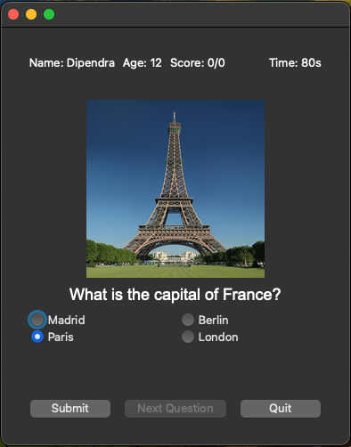

# Quiz Game

This is a simple quiz game application built using both Tkinter and PyQt6, to compare how both tool can help build desktop application.
The application allows users to answer multiple-choice questions, keeps track of their score, and displays the results at the end of the quiz.

## Features

- User can enter their name and age.
- Randomized multiple-choice questions.
- Displays images associated with questions if any.
- Keeps track of the user's score.
- Displays the total time taken and average time per question.



## Requirements

- Python 3.x (with Tkinter support)
- PyQt6
- requests
- Pillow

## Folder structure
```bash
quiz_game/
│
├── data/
│   └── questions.json
│
├── images/
│   └── (store question images here)
│
├── pyqt6/
│   ├── main.py
│   ├── quiz_manager.py
│   ├── user_interface.py
│   └── user.py
│
├── tkinter/
│   ├── main.py
│   ├── quiz_manager.py
│   ├── user_interface.py
│   └── user.py
│
└── requirements.txt
```

## Installation

1. Clone the repository:
    ```bash
    git clone https://github.com/ByteScapeAU/python-quiz-game.git
    cd py-quiz-game
    ```

2. Create a virtual environment and activate it:
    ```bash
    python -m venv .venv
    source .venv/bin/activate  # On Windows: venv\Scripts\activate
    ```

3. Install the dependencies:
    ```bash
    pip install -r requirements.txt
    ```

## Usage

Run the application:
```bash
# try both version of the game
python tkinter/main.py
python pyqt6/main.py
```

## Contributing
Author : Dipendra Paudel (https://www.linkedin.com/in/dipendra-paudel/)

You are welcome to playaround and fork it if necessary. Contributions are welcome! Please open an issue or submit a pull request for any improvements or bug fixes.
